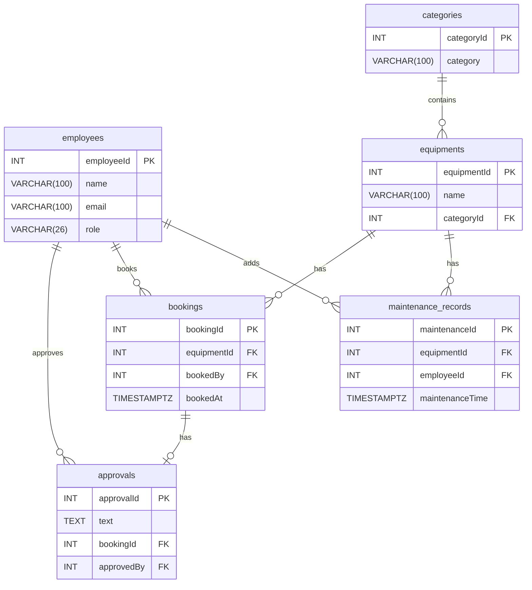

# ER Diagram

```mermaid
erDiagram
    employees{
        INT employeeId PK
        VARCHAR(100) name
        VARCHAR(100) email
        VARCHAR(26) role
    }
    equipments{
        INT equipmentId PK
        VARCHAR(100) name
        INT categoryId FK
    }
    categories{
        INT categoryId PK
        VARCHAR(100) category
    }
    bookings{
        INT bookingId PK
        INT equipmentId FK
        INT bookedBy FK

        TIMESTAMPTZ bookedAt
    }
    approvals{
        INT approvalId PK
        TEXT text
        INT bookingId FK
        INT approvedBy FK
    }
    maintenance_records{
        INT maintenanceId PK
        INT equipmentId FK
        INT employeeId FK
        TIMESTAMPTZ maintenanceTime
    }

    employees|| --o{maintenance_records:"adds"
    employees|| --o{bookings:"books"
    equipments||--o{ maintenance_records:"has"
    categories||--o{ equipments: "contains"
    equipments|| --o{ bookings : "has"
    bookings|| --o| approvals: "has"
    employees|| --o{approvals: "approves"

```
