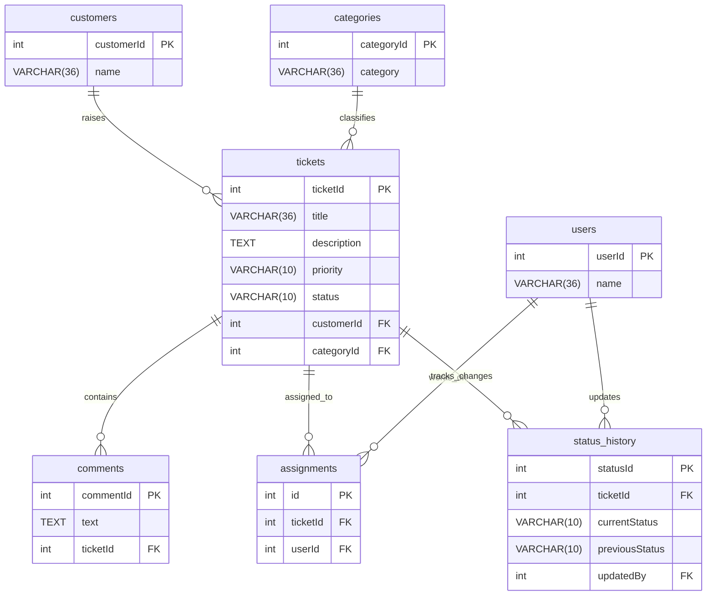

# ER Diagram

```mermaid
erDiagram
    users{
        int userId PK
        VARCHAR(36) name
    }
    customers{
        int customerId PK
        VARCHAR(36) name
    }
    categories{
        int categoryId PK
        VARCHAR(36) category
    }
    tickets{
        int ticketId PK
        VARCHAR(36) title
        TEXT description
        VARCHAR(10) priority
        VARCHAR(10) status
        int customerId FK
        int categoryId FK
    }
    comments{
        int commentId PK
        TEXT text
        int ticketId FK
    }
    assignments{
        int id PK
        int ticketId FK
        int userId FK
    }
    status_history{
        int statusId PK
        int ticketId FK
       VARCHAR(10) currentStatus
        VARCHAR(10) previousStatus
        int updatedBy FK
    }

    customers||--o{ tickets: "raises"
    tickets||--o{ comments: "contains"
    categories||--o{ tickets: "classifies"
    tickets||--o{ assignments: "assigned_to"
    users||--o{ assignments: "works_on"
    tickets||--o{ status_history: "tracks_changes"
   users||--o{status_history: "updates"

```
